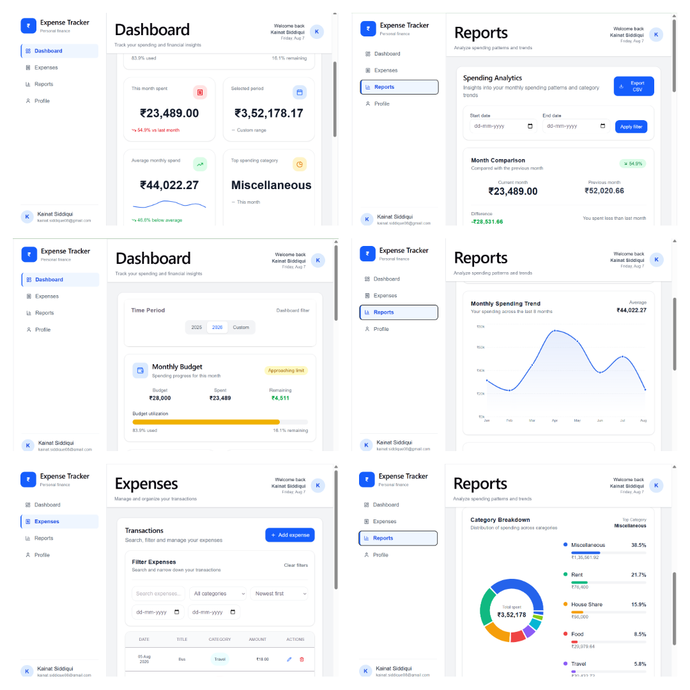

# Expense Tracker – Full Stack Personal Finance & Analytics Platform

A full-stack **Expense Tracker** web application built with **FastAPI, React, TypeScript, PostgreSQL, and Docker**. The application helps users track expenses, manage monthly budgets, analyze spending patterns, and visualize financial insights through interactive dashboards and reports.

The project demonstrates a complete full-stack development workflow including **JWT authentication, REST APIs, SQLAlchemy ORM, Alembic migrations, responsive React UI, analytics endpoints, and cloud deployment on Render and Vercel**.

## Live demo (Available till September 2026)

* **Frontend (Vercel):** https://expense-tracker-api-git-main-portfolio-projects6.vercel.app
* **Backend API (Render):** https://expense-tracker-api-gnnt.onrender.com
* **API Documentation:** https://expense-tracker-api-gnnt.onrender.com/docs

## 📸API Preview



## Features

### Authentication

* User registration and login
* JWT-based authentication
* Protected routes
* Secure password hashing

### Expense management

* Add, edit, and delete expenses
* Categorize expenses
* Date-based transactions
* Search and filter expenses
* Sort by date and amount
* Pagination for transaction history

### Budget management

* Monthly budget tracking
* Budget utilization progress
* Remaining budget calculation
* Budget update functionality

### Dashboard analytics

* Monthly spending trend
* Average monthly spend
* Top spending category
* Selected period spending
* Spending comparison with previous month
* Visual KPI cards

### Reports & insights

* Category-wise spending breakdown
* Monthly trend analysis
* Category trend analysis
* Month-to-month comparison
* Weekend vs weekday spending analysis
* Highest spending month
* Largest transaction analysis

### User profile

* Profile information
* Update profile details
* Personalized dashboard

### Responsive UI

* Mobile-friendly layout
* Responsive sidebar navigation
* Interactive charts
* Clean modern dashboard design

## Tech stack

### Frontend

* React
* TypeScript
* Vite
* Tailwind CSS
* Axios
* Recharts
* React Router

### Backend

* FastAPI
* SQLAlchemy
* PostgreSQL
* Alembic
* JWT Authentication
* Passlib
* Pydantic

### Deployment

* Vercel (Frontend)
* Render (Backend & PostgreSQL)
* Docker
* Docker Compose

## Project structure

```text
Expense-Tracker-API/
├── app/
│   ├── routers/
│   ├── services/
│   ├── models.py
│   ├── schemas.py
│   ├── database.py
│   └── main.py
├── alembic/
├── scripts/
├── tests/
├── Dockerfile
├── docker-compose.yml
└── expense-tracker-frontend/
    ├── src/
    │   ├── components/
    │   ├── pages/
    │   ├── services/
    │   ├── layouts/
    │   └── utils/
    └── package.json
```

## Architecture

```text
React (Vercel)
        |
        | REST API
        |
FastAPI (Render)
        |
SQLAlchemy ORM
        |
PostgreSQL (Render)
```

## API highlights

### Authentication

* POST /auth/register
* POST /auth/login

### Expenses

* GET /expenses
* POST /expenses
* PATCH /expenses/{id}
* DELETE /expenses/{id}

### Budget

* GET /budget
* PUT /budget

### Dashboard

* GET /dashboard

### Reports

* GET /reports/monthly-trend
* GET /reports/category-breakdown
* GET /reports/category-trends
* GET /reports/month-comparison
* GET /reports/weekend-vs-weekday

## Database

The application uses **PostgreSQL** in production and **SQLite** for local development.

Database management is handled through **Alembic migrations**, making schema changes version-controlled and deployment-friendly.

## Local setup

### Clone the repository

```bash
git clone https://github.com/Kainatsiddiqui/Expense-Tracker-API.git
cd Expense-Tracker-API
```

### Backend

```bash
python -m venv .venv
.venv\\Scripts\\activate

pip install -r requirements.txt

alembic upgrade head

uvicorn app.main:app --reload
```

### Frontend

```bash
cd expense-tracker-frontend

npm install

npm run dev
```

## Environment variables

### Backend (.env)

```text
DATABASE_URL=sqlite:///expense_tracker.db
SECRET_KEY=your-secret-key
ALGORITHM=HS256
ACCESS_TOKEN_EXPIRE_MINUTES=30
```

### Frontend (.env.local)

```text
VITE_API_URL=http://localhost:8000
```

## Docker

Run the complete application using Docker Compose.

```bash
docker compose up --build
```

## Key learning outcomes

This project helped me gain hands-on experience with:

* Designing RESTful APIs
* JWT authentication and authorization
* SQLAlchemy ORM and PostgreSQL
* Alembic database migrations
* Responsive React dashboard development
* Data visualization with Recharts
* Docker containerization
* Full-stack deployment using Render and Vercel
* CORS configuration and production debugging
* Environment-based application configuration

## Future enhancements

* Recurring expenses
* Savings goals
* Export reports to PDF/Excel
* Email notifications
* Multi-currency support
* Progressive Web App (PWA)
* Expense forecasting
* AI-powered spending insights

## Acknowledgements

This project was built as a personal learning and portfolio project to strengthen my full-stack development skills, including backend API development with FastAPI, frontend development with React and TypeScript, database design with PostgreSQL, Docker, authentication, analytics dashboards, and cloud deployment.
AI-assisted development tools were used during development for learning, debugging, and accelerating implementation, while the project architecture, integration, testing, deployment, and customization were completed as part of my hands-on learning process.

## Author

**Kainat Siddiqui**

* GitHub: https://github.com/Kainatsiddiqui
* LinkedIn: https://www.linkedin.com/in/kainatsiddiqui
